#09231 강영훈

# AWS Instance 접속

1. local의 C:\Windows\System32\drivers\etc\hosts 파일 변경후 접속 하기 (public)

로컬 public DNS
```
52.79.196.62 cm
52.79.198.57 master
52.79.205.192 slave1
52.79.34.147 slave2
54.180.55.203 slave3
```

aws 프라이빗 DNS
```
172.31.39.139 cm
172.31.39.87 master
172.31.44.73 slave1
172.31.37.150 slave2
172.31.33.196 slave3
```
파일 변경 후 
ssh -i skcc.pem centos@cm

pem파일 위치 디렉토리 이동 및 command실행

접속 계정 명 : centos
```
ssh -i skcc.pem centos@cm
```
# 리눅스 버전확인

```
grep . /etc/*-release
```
!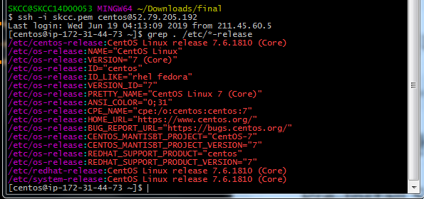


# CentOS 7 관련

# Pre-Install Step 생략(미리 설정된 AWS 사용)

1. yum update
```
sudo yum update
sudo yum install -y wget
```

2. firewall 정지

```
$ systemctl stop firewalld
$ systemctl disable firewalld
```
3. Selinux 정지 [보안 프로그램]

```
$ sestatus
$ sudo vi /etc/selinux/config
```

4. NTP 설정 [Cluster host 시간 동기화]

** 대상: cluster 전체 host **
server kr.pool.ntp.org 
server time.bora.net
server time.kornet.net
추가
```
sudo yum install -y ntp
```
```
sudo vi /etc/ntp.conf
```

```
$ sudo systemctl start ntpd
$ sudo systemctl enable ntpd
$ ntpq -p
```

5. Passwordless SSH connection setting

 5.1) 모든 서버의 root 계정 passwd 설정.
```
sudo passwd centos (centos/ admin)

```
 5.2) /etc/ssh/sshd_config 파일 수정

 ```
 $sudo vi sshd_config
>> PasswordAuthentication yes

$sudo systemctl restart sshd.service

 ```


 5.3) 모든 서버에서 host파일에 서버정보 입력
-- /etc로 이동.

```
sudo vi /etc/hosts
```
```
172.31.39.139 cm
172.31.39.87 master
172.31.44.73 slave1
172.31.37.150 slave2
172.31.33.196 slave3
```

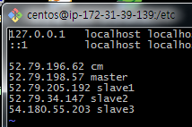
5.4) 각 서버에서 set hostname 해주기.

```
hostname -f
sudo hostnamectl set-hostname master01.cdhcluster.com
sudo hostnamectl set-hostname util01.cdhcluster.com  
sudo hostnamectl set-hostname data01.cdhcluster.com  
sudo hostnamectl set-hostname data02.cdhcluster.com  
sudo hostnamectl set-hostname data03.cdhcluster.com  
hostname -f


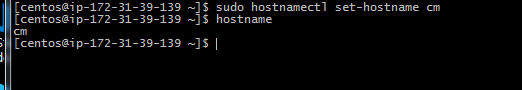
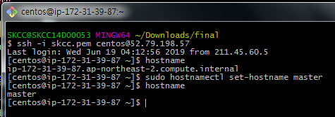
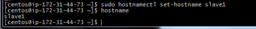
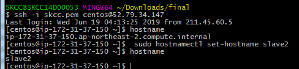

init 6

```

6. (util 노드) ssh 용 public key 생성하기

```
** user를 su로 변경

root로 이동하여 cd .ssh

ssh-keygen -t rsa
```
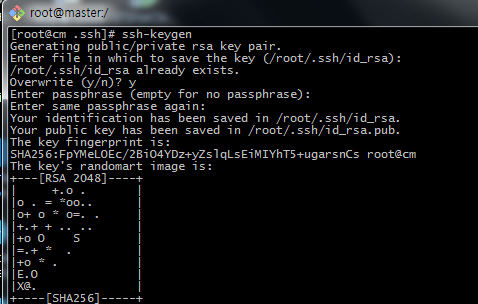

7. 1~5번까지 각 노드에서 완료 후 master노드에서 slave노드로 public key 정보 복사하기.

```
cd ~/.ssh 이동
sudo ssh-copy-id -i ~/.ssh/id_rsa.pub master
sudo ssh-copy-id -i ~/.ssh/id_rsa.pub slave1
sudo ssh-copy-id -i ~/.ssh/id_rsa.pub slave2
sudo ssh-copy-id -i ~/.ssh/id_rsa.pub slave3
```

!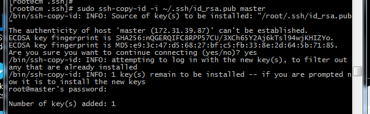

접속 시도해서 확인.
```
ssh mn1 
ssh util01
```


# Install CM

## Configure the repository for CM 5.15.2

모든 노드에 대해서 wget 설치
```
yum install wget
```

```
A. Configure repository

# sudo wget https://archive.cloudera.com/cm5/redhat/7/x86_64/cm/cloudera-manager.repo \
-P /etc/yum.repos.d/

# sudo vi /etc/yum.repos.d/cloudera-manager.repo

!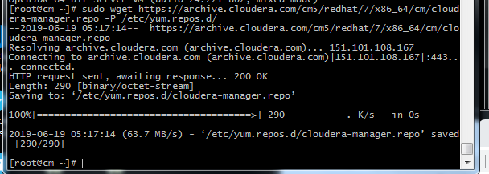

>> baseurl=https://archive.cloudera.com/cm5/redhat/6/x86_64/cm/5.15.2/

!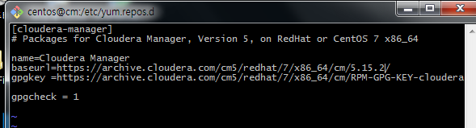

# sudo rpm --import \
https://archive.cloudera.com/cm5/redhat/7/x86_64/cm/RPM-GPG-KEY-cloudera

```

# JDK 설치

JDK 설치가능 목록
!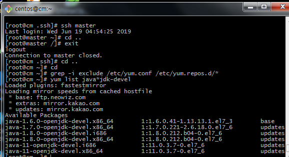

A. util01 jdk 설치
hostname

B. REPOSITORY 확인

```
grep -i exclude /etc/yum.conf /etc/yum.repos.d/*
yum repolist all
```

 JDK 설치
 ```
 sudo yum install oracle-j2sdk1.7
 ```

 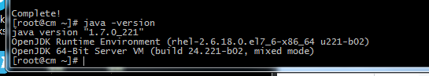


# cm에 클라우데라 서버설치

```
# hostname
# sudo yum install cloudera-manager-daemons cloudera-manager-server
```
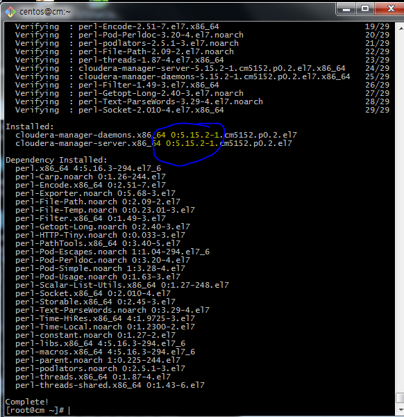


# cm 마리아db 설치

```
# hostname
# sudo yum install -y mariadb-server
# sudo systemctl enable mariadb
# sudo systemctl start mariadb
# sudo /usr/bin/mysql_secure_installation
```

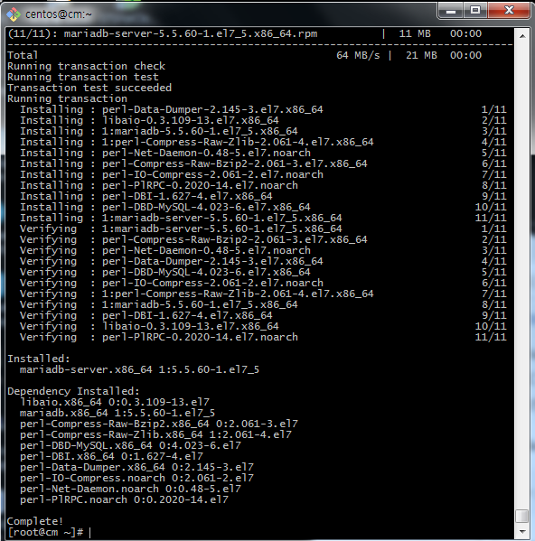

```
$ sudo systemctl enable mariadb
$ sudo systemctl start mariadb
$ sudo /usr/bin/mysql_secure_installation


!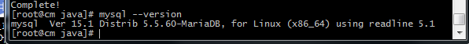

[...]
Enter current password for root (enter for none):
OK, successfully used password, moving on...
[...]
Set root password? [Y/n] Y
New password:
Re-enter new password:
[...]
Remove anonymous users? [Y/n] Y
[...]
Disallow root login remotely? [Y/n] N
[...]
Remove test database and access to it [Y/n] Y
[...]
Reload privilege tables now? [Y/n] Y
[...]
All done!  If you've completed all of the above steps, your MariaDB
installation should now be secure.

Thanks for using MariaDB!
```
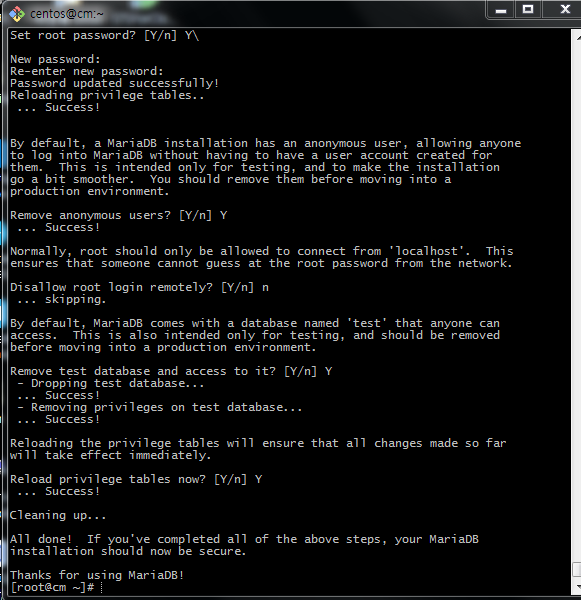


# MySQL JDBC Driver (mariaDB) 설치

Download the MySQL JDBC driver  (모든 노드에 설치)
```
sudo wget https://dev.mysql.com/get/Downloads/Connector-J/mysql-connector-java-5.1.47.tar.gz

```
```
# tar zxvf mysql-connector-java-5.1.47.tar.gz
# sudo mkdir -p /usr/share/java/
# cd mysql-connector-java-5.1.47
# sudo cp mysql-connector-java-5.1.47-bin.jar /usr/share/java/mysql-connector-java.jar

# cd /usr/share/java/
# sudo yum install mysql-connector-java
```
 


 # MariaDB DB, USER 생성

A. mysql Version 확인 및 로그인
```
# mysql --version 
# mysql -u root -p
```

B. Database 확인
```
> SHOW DATABASES;
```

C. DB, USER 생성

```
CREATE DATABASE scm DEFAULT CHARACTER SET utf8 DEFAULT COLLATE utf8_general_ci;
GRANT ALL ON scm.* TO 'scm'@'%' IDENTIFIED BY 'scm';

CREATE DATABASE amon DEFAULT CHARACTER SET utf8 DEFAULT COLLATE utf8_general_ci;
GRANT ALL ON amon.* TO 'amon'@'%' IDENTIFIED BY 'amon';

CREATE DATABASE rmon DEFAULT CHARACTER SET utf8 DEFAULT COLLATE utf8_general_ci;
GRANT ALL ON rmon.* TO 'rmon'@'%' IDENTIFIED BY 'rmon';

CREATE DATABASE hue DEFAULT CHARACTER SET utf8 DEFAULT COLLATE utf8_general_ci;
GRANT ALL ON hue.* TO 'hue'@'%' IDENTIFIED BY 'hue';

CREATE DATABASE metastore DEFAULT CHARACTER SET utf8 DEFAULT COLLATE utf8_general_ci;
GRANT ALL ON metastore.* TO 'metastore'@'%' IDENTIFIED BY 'metastore';

CREATE DATABASE sentry DEFAULT CHARACTER SET utf8 DEFAULT COLLATE utf8_general_ci;
GRANT ALL ON sentry.* TO 'sentry'@'%' IDENTIFIED BY 'sentry';

CREATE DATABASE oozie DEFAULT CHARACTER SET utf8 DEFAULT COLLATE utf8_general_ci;
GRANT ALL ON oozie.* TO 'oozie'@'%' IDENTIFIED BY 'oozie';

FLUSH PRIVILEGES;

```
 

 생성후

 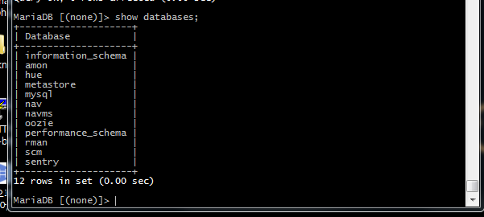

# CM DATABASE 셋업

```
# sudo /usr/share/cmf/schema/scm_prepare_database.sh mysql scm scm-user somepassword
# sudo systemctl start cloudera-scm-server
# tail -f /var/log/cloudera-scm-server/cloudera-scm-server.log

```


# Cluster 설정

```
http://util01:7180/
>> admin/admin

## 클러스터 설치

-- 선택
enterprise 체험판, trial 

--  호스토 지정
cm, master, slave1, slave2, slave3
>> 호스트 IP 확인하기

-- ssh 로그인 인증 
단일사용자 선택 (centos)

유저/ 패스워드 (centos/ admin)

-- 클러스터 설치

### 기본 서비스 설치
>> https://www.cloudera.com/documentation/enterprise/5-15-x/topics/cm_ig_host_allocations.html#host_role_assignments 
>> 3 - 10 Worker Hosts without High Availability


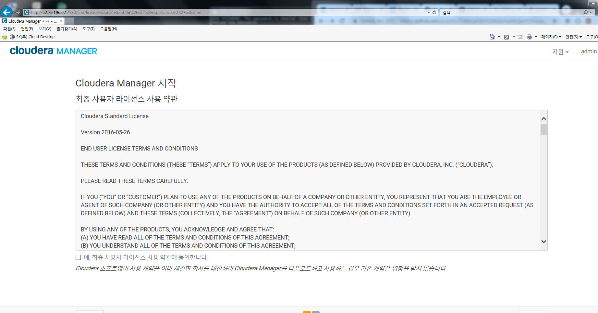


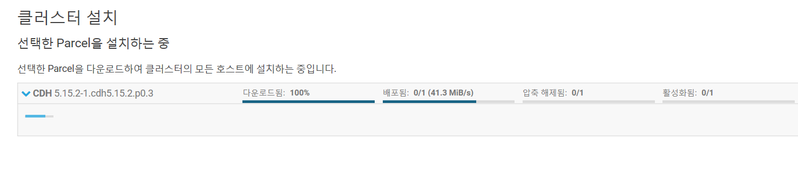
#### HDFS


#### YARN
#### ▪ ZOOKEEPER 3개로 설정하기

```


# training 계정 생성

## 리눅스 계정 생성
```
$ adduser training
$ passwd training
$ usermod -aG wheel training
## 원래는 visudo에서 주석해제 단계가 있는데 우선은 하지말자

```

##  HDFS 계정생성

hue web ui에서 계정생성하면 자동으로 생성됨.


mysql -u root -p 
GRANT ALL ON *.* TO 'training'@'%' IDENTIFIED BY 'training';
show grants for 'training'@'%';
