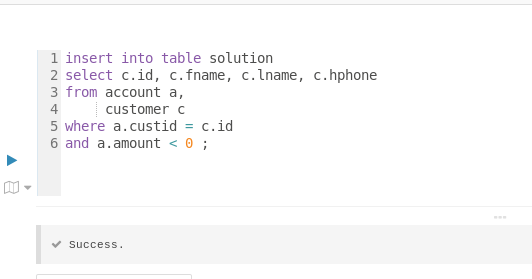
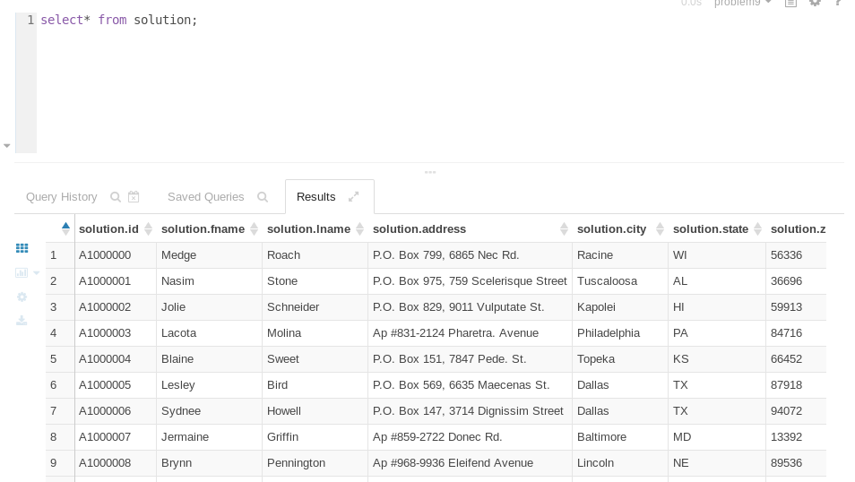

###09231 강영훈

##
1번
```
select a.id as id, 
       a.type as type,
       a.status as status,
       a.amount as amount,
       a.amount - b.average as different
from account a,
     (select type, avg(amount) as average from account group by type) b 
where status='Active'
and a.type = b.type
```
결과


##
2번
```
create external table employee
(id int,
fname string,
lname string,
address string,
city string,
state string,
zip string,
birthday string,
hireday string)
ROW FORMAT DELIMITED
    FIELDS TERMINATED BY ','
    LINES TERMINATED BY '\n'
    STORED AS PARQUET
    LOCATION '/user/training/problem2/data/employee'
```
결과

테이터조회


##
3번

테이블 생성
create external table solution
( id string, 
  fname string, 
  lname string, 
  hpnone string)
 ;

데이터 삽입



조회


##
4번
employee1
```
[training@localhost ~]$ hdfs dfs -cat /user/training/problem4/data/employee1/part-m-00000 | more
10000000	Olga	Booker	Ap #643-2741 Proin Street	Gresham	OR	42593-0000
10000001	Raja	Spence	P.O. Box 765, 7700 Eros Rd.	Duluth	MN	67110-0000
10000002	Meredith	Schwartz	3414 At Road	San Antonio	TX	35713-0000
10000003	Thor	Lloyd	2703 Amet, Road	Rock Springs	WY	73861-0000
10000004	Arden	Mooney	Ap #888-1187 Aliquam Road	Rockville	MD	82478-0000
10000005	Kenneth	Lucas	Ap #637-8746 Feugiat Av.	Boston	MA	84047-0000
10000006	Leonard	Goodwin	Ap #465-7707 Aliquam Avenue	Rock Springs	WY	91337-0000
10000007	Elton	Conrad	P.O. Box 787, 8889 Nam Street	Auburn	ME	28280-0000
```

employee2
```
[training@localhost ~]$ hdfs dfs -cat  /user/training/problem4/data/employee2/part-m-00000 | more
10010000,656,HULL,WARREN,7593 Pede. Rd.,Kansas City,MO,55725
10010001,142,HAYES,KASPER,425-3365 Feugiat Rd.,Springfield,MO,27927
10010002,417,BARRETT,SYBILL,Ap #367-7227 Eu Street,Hartford,CT,83690
10010003,925,VALDEZ,THOR,"212-6890 Risus, St.",Springfield,MO
10010004,832,BALLARD,WYNNE,748-4292 Vel Road,Hillsboro,OR,53903
10010005,536,GLASS,ZOE,Ap #565-7061 Massa. Rd.,Bear,DE,83658
10010006,987,BEARD,HIRAM,"P.O. Box 997, 6136 Ut Ave",Lakewood,CO
10010007,832,DANIEL,MAYA,"P.O. Box 780, 6779 Mattis. St.",Springfield,MO
```

4번 피그이용
```
[training@localhost ~]$ pig
log4j:WARN No appenders could be found for logger (org.apache.hadoop.util.Shell).
log4j:WARN Please initialize the log4j system properly.
log4j:WARN See http://logging.apache.org/log4j/1.2/faq.html#noconfig for more info.
grunt> data1 = LOAD '/user/training/problem4/data/employee1/part-m-00000' AS 
>>  (customerID : int,
>>   fname : chararray, 
>>   lname : chararray, 
>>   address:chararray, 
>>   city:chararray,
>>   state:chararray,
>>   zip:chararray);
grunt> emp_data1 = FOREACH data1 GENERATE customerID,fname,lname,address,city,state,SUBSTRING(zip,0,5);
grunt> data2 = LOAD '/user/training/problem4/data/employee2/part-m-00000'USING PigStorage(',')AS
>> ( customerID : int,
>>   etc : int, 
>>   lname : chararray, 
>>   fname : chararray, 
>>   address:chararray, 
>>   city:chararray,
>>   state:chararray,
>>   zip:chararray
>> )
>> ;
grunt> emp_data2 = FOREACH data2 GENERATE customerID,UCFIRST(LOWER(fname)),UCFIRST(LOWER(lname)),address,city,state,zip;
grunt> join_data = UNION emp_data1, emp_data2 ;
grunt> filtered_data = FILTER join_data by state == 'CA';
grunt> STORE filtered_data INTO '/user/training/problem4/solution';
grunt> 
```


4번 결과

파일 확인
```
[training@localhost ~]$ hdfs dfs -ls /user/training/problem4/solution
Found 3 items
-rw-rw-rw-   1 training supergroup          0 2019-06-19 00:18 /user/training/problem4/solution/_SUCCESS
-rw-rw-rw-   1 training supergroup        179 2019-06-19 00:18 /user/training/problem4/solution/part-m-00000
-rw-rw-rw-   1 training supergroup        295 2019-06-19 00:18 /user/training/problem4/solution/part-m-00001
```

데이터확인
```
[training@localhost ~]$ hdfs dfs -cat /user/training/problem4/solution/part-m-0000*
10000063	Burton	Hayes	Ap #720-4012 Vivamus Avenue	San Diego	CA	96066
10000068	Ria	Herman	2974 Cras St.	San Francisco	CA	95310
10000073	Daquan	Roy	7636 Et Rd.	Los Angeles	CA	96606
10010024	Preston	Wood	2782 Amet Street	San Francisco	CA	92124
10010032	Bo	Rojas	Ap #445-6043 Massa Av.	San Diego	CA	92363
10010037	Zane	Banks	4778 Interdum. St.	San Diego	CA	92120
10010079	Ursa	Justice	3321 Risus. Ave	San Jose	CA	96850
10010088	Declan	Booth	4048 Nunc Rd.	San Francisco	CA	96324
```


##
5번
soluntion.sql
```
select concat_ws('\t',fname , lname, city, state)
from customer c
where c.city = 'Palo Alto'
and   c.state = 'CA'
union all
select concat_ws('\t',fname , lname, city, state)
from employee e
where e.city = 'Palo Alto'
and   e.state = 'CA'
```

5번결과


##
6번 테이블 생성

```
create external table solution
(
  id int , 
  fname string,
  lname string, 
  address string,
  city string,
  state string,
  zip string,
  birthday string
 ) 
```

데이터 삽입
```
insert into table solution 
select id,
       fname,
       lname,
       address,
       city,
       state,
       zip,
       substr(birthday,1,5)
from employee;
```

6번결과


##
7번 
쿼리
```
select concat(fname,' ' , lname)
from employee e
where e.city = 'Seattle'
```

7번 결과


##
8번

스쿱 명령어
```
sqoop export \
--table solution \
--connect "jdbc:mysql://localhost/problem8" \
--username cloudera \
--password cloudera \
--export-dir "/user/training/problem8/data/customer/" \
--fields-terminated-by "\t" \
--columns "id, fname , lname , address , city, state , zip , birthday" ;
```

8번 수행결과

8번 데이터결과


##
9번

테이블생성
```
use problem9 ;
create external table solution 
( 
 id string,
 fname string,
 lname string,
 address string,
 city string,
 state string,
 zip string,
 birthday string
);
```

데이터 삽입
```
insert into solution
select distinct concat('A',id) as id,
       fname,
       lname,
       address,
       city,
       state,
       zip,
       birthday
from customer;
```
9번 결과
스샷


##
10번
뷰생성
```
create view solution as
select c.id as id , 
       c.fname as fname, 
       c.lname as lname,
       c.city as city,
       c.state as state,
       b.charge as charge, 
       substr(b.tstamp,0,10) as billdate
from customer c , 
     billing b
where c.id = b.id 
;
```
10번 결과 스샷


##
11번 
#
a.Which top three products has Dualcore sold more of than any other?

```
select p.name , count(*)
  from order_details d,
       products p
 where d.prod_id  = p.prod_id
   and p.brand='Dualcore'
group by p.name
limit 3 ;
```
11-a 수행결과


#
b.Calculating Revenue and Profit – write a query to show Dualcore’s revenue (total price of products sold) and profit (price minus cost) by date.

```
select to_date(o.order_date), 
       sum(p.price) as revenue , 
       sum(p.price - p.cost) as profit
  from orders o,
       order_details d,
       products p
 where o.order_id = d.order_id
   and d.prod_id  = p.prod_id
   and p.brand='Dualcore'
group by to_date(o.order_date);
```

11-b 수행결과


c.Calculating the order Total – Which ten orders had the highest total dollar amounts?

```
select o.order_id,
       sum(p.price) as total
  from orders o,
       order_details d,
       products p
 where o.order_id = d.order_id
   and d.prod_id  = p.prod_id
 group by o.order_id
 order by total desc
 limit 10;  
```

11-c 결과

